##### Міністерство освіти і науки України
##### Національний технічний університет України
##### «Київський політехнічний інститут імені Ігоря Сікорського»
##### Факультет інформатики та обчислювальної техніки
##### Кафедра обчислювальної техніки
---
# Лабораторна робота №1
## з дисципліни «Структури даних і алгоритми»

---
##### Виконав
Студент групи: ІО-61\
Аверченко Микола Миколайович\
номер у списку групи: 1

##### Перевірив
Русінов Володимир Володимирович

###### Київ 2026

---
## Завдання

Задано дійсне число x. Визначити значення заданої за варіантом кусково-неперервної функції y(x), якщо воно існує, або вивести на екран повідомлення про неіснування функції для заданого x.

Розв'язати задачу **двома способами** (написати дві програми):

1. У програмі дозволяється використовувати тільки одиничні операції порівняння (`=`, `<>`, `<`, `<=`, `>`, `>=`) і **не дозволяється** використовувати булеві (логічні) операції (`not`, `and`, `or` тощо);
2. У програмі необхідно **обов'язково** використати булеві (логічні) операції (`not`, `and`, `or` тощо); використання булевих операцій не повинно бути надлишковим.

###### Умови до варіанту 1:
Для заданого дійсного x обчислити:

```
         f1(x) ,  x ∈ D1
y(x) =
         f2(x) ,  x ∈ D2
```

|Варіант|f1(x), x ∈ D1|f2(x), x ∈ D2|
|---|---|---|
|1, 11, 21|10x³ + 7x/5 + 2, x ∈ [–49,–10) ∪ (0,10]|–x + 9, x ∈ (20, +∞)|

---
## Блок схеми

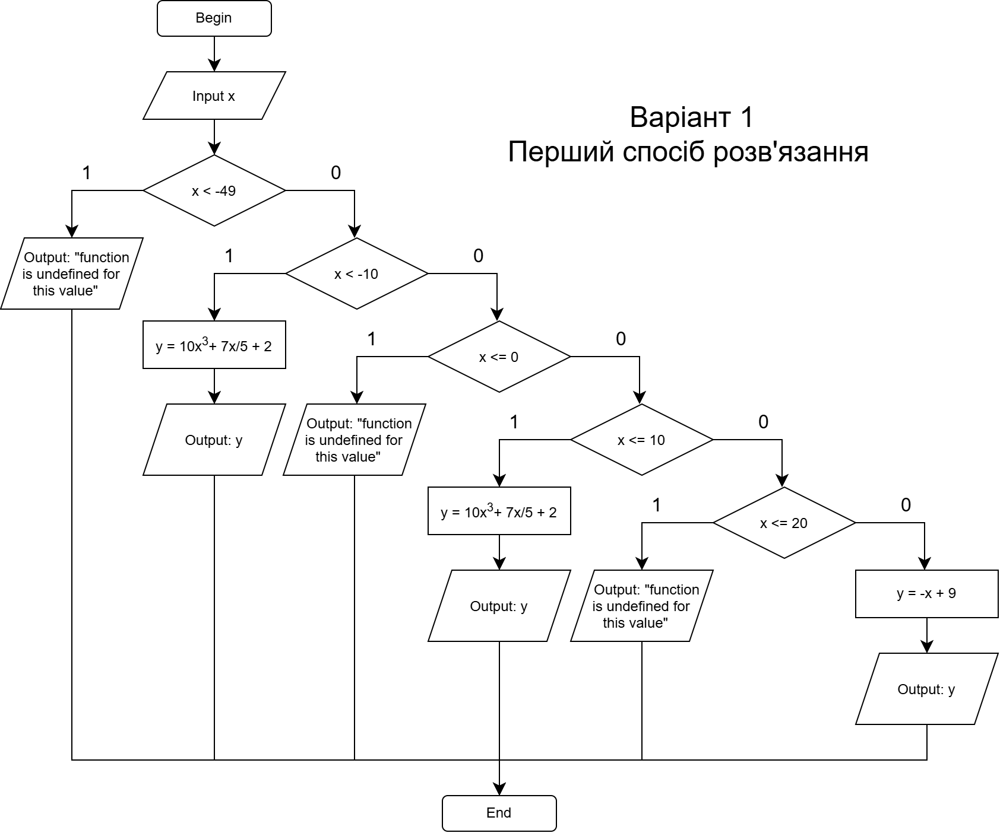

---

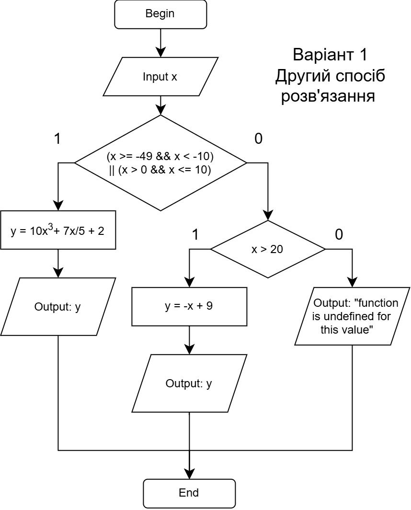

---
## Програмний код програм
#### Перший розв'язок (task1.c)

```c
#include <stdio.h>

int main(int argc, char *argv[]) {
  double x;
  double y;

  scanf("%lf", &x);

  if (x < -49) {
    printf("function is undefined for this value\n");
  } else if (x < -10) {
    y = 10 * x * x * x + 7 * x / 5 + 2;
    printf("%lf\n", y);
  } else if (x <= 0) {
     printf("function is undefined for this value\n");
  } else if (x <= 10) {
    y = 10 * x * x * x + 7 * x / 5 + 2;
    printf("%lf\n", y);
  } else if ( x <= 20) {
    printf("function is undefined for this value\n");
  } else {
    y = -x + 9;
    printf("%lf\n", y);
  }

  return 0;
}
```
#### Другий розв'язок (task2.c)
```c
#include <stdio.h>

int main(int argc, char *argv[]) {
  double x;
  double y;

  scanf("%lf", &x);
  
  if ((x >= -49 && x < -10) || (x > 0 && x <= 10)) {
    y = 10 * x * x * x + 7 * x / 5 + 2;
    printf("%lf\n", y);
  } else if (x > 20) {
    y = -x + 9;
    printf("%lf\n", y);
  } else {
    printf("function is undefined for this value\n");
  }

  return 0;
}
```

---
## Тести кожної програми
Тестовий набір значень та очікувані результати:

| №   | Тестові значення | Очікуваний результат                   |
| --- | ---------------- | -------------------------------------- |
| 1   | -52.5            | "function is undefined for this value" |
| 2   | -49              | -1176556.6                             |
| 4   | -10              | "function is undefined for this value" |
| 5   | 0                | "function is undefined for this value" |
| 6   | 0.01             | 2.01401                                |
| 7   | 10               | 10016                                  |
| 8   | 20               | "function is undefined for this value" |
| 9   | 23               | -14                                    |

---
###### Результати тестів:

Перший розв'язок:\

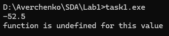\
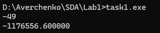\
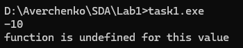\
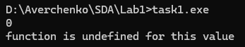\
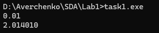\
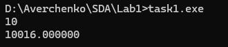\
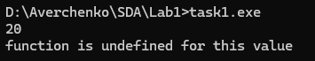\
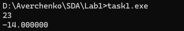

Другий розв'язок:\
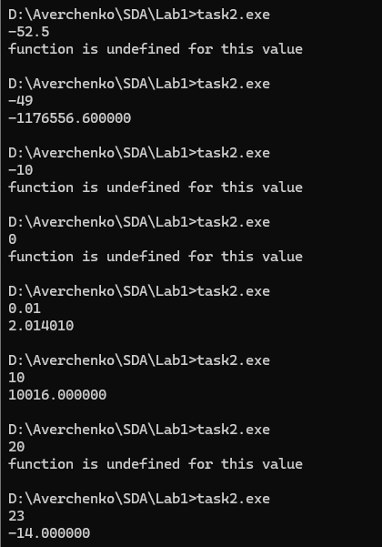


---
